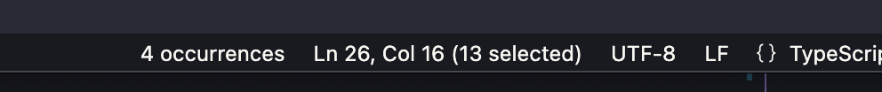

# 🎰 Occurrence Counter VSCode Extension

When text is selected in the editor, this extension will show a counter in the status bar indicating how many other occurrences of that text exist in the current file.

